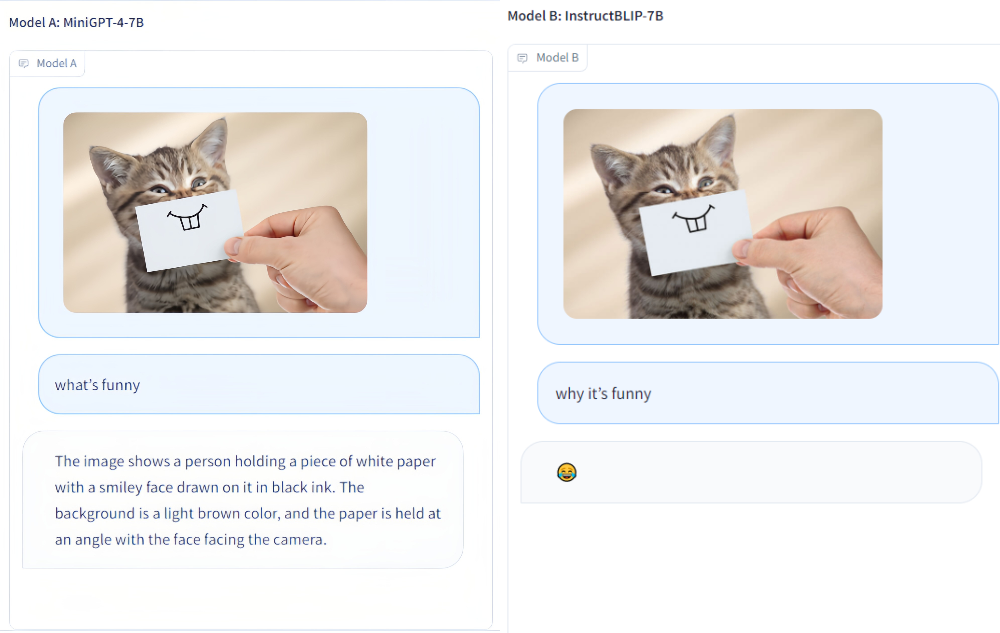
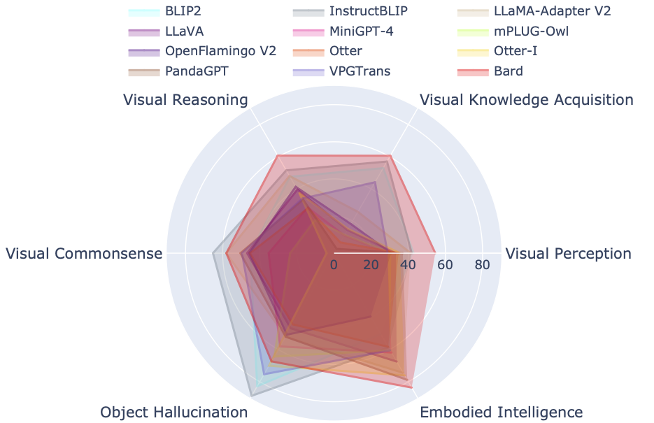
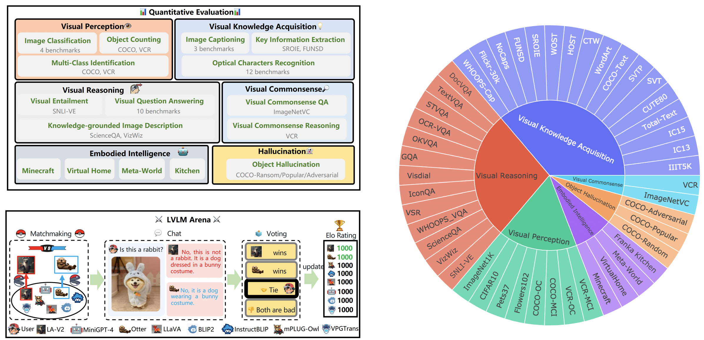

### Multi-Modality Arena 🚀

  

<p  align="center"></p>

  


<!-- ## Description -->

**Multi-Modality Arena** is an evaluation platform for large multi-modality models. Following [Fastchat](https://chat.lmsys.org/), two anonymous models side-by-side are compared on a visual question-answering task. We release the  [**Demo**](http://vlarena.opengvlab.com)  and welcome the participation of everyone in this evaluation initiative.

[](http://vlarena.opengvlab.com)
[](https://arxiv.org/abs/2306.09265)
[](https://arxiv.org/abs/2308.03729)
[](https://github.com/OpenGVLab/Multi-modality-Arena)🔥🔥🔥
                

 <p  align="center"></p>

## Holistic Evaluation of Large Multimodal Models

### Tiny LVLM-eHub: Early Multimodal Experiments with Bard

- Tiny datasets: only 50 randomly selected sampels for each dataset, i.e., 42 text-related visual benchmarks and 2.1K samples in total for ease of use.
- More models: another 4 models, i.e., 12 models in total, including **Google Bard**.
- *ChatGPT Ensemble Evalution*: improved agreement with human evaluation than previous word matching approach.

<p  align="center"></p>

### LVLM-eHub: An Evaluation Benchmark for Large Vision-Language Models 🚀

LVLM-eHub is a comprehensive evaluation benchmark for publicly available large multimodal models (LVLM).  It extensively evaluates $8$ LVLMs in terms of $6$ categories of multimodal capabilities with $47$ datasets and $1$ arena online platform.
 <p  align="center"></p>

## Update
- 🔥 Aug. 8, 2023. We released [**[Tiny LVLM-eHub]**](https://arxiv.org/abs/2308.03729), while the corresponding source code and inference/evaluation results are coming soon. Please stay tuned!
- Jun. 15, 2023. We release [**[LVLM-eHub]**](https://arxiv.org/abs/2306.09265), an evaluation benchmark for large vision-language models. The code is coming soon.
- Jun. 8, 2023. Thanks, Dr. Zhang, the author of VPGTrans, for his corrections. The authors of VPGTrans mainly come from NUS and Tsinghua University. We previously had some minor issues when re-implementing VPGTrans, but we found that its performance is actually better. For more model authors, please contact me for discussion at the [Email](shaowenqi@pjlab.org.cn). Also, please follow our model ranking list, where more accurate results will be available.
- May. 22, 2023. Thanks, Dr. Ye, the author of mPLUG-Owl, for his corrections. We fix some minor issues in our implementation of mPLIG-Owl.
## Supported Multi-modality Models

The following models are involving in randomized battles currently,

 - [**KAUST/MiniGPT-4**](https://github.com/Vision-CAIR/MiniGPT-4)
 - [**Salesforce/BLIP2**](https://github.com/salesforce/LAVIS/tree/main/projects/blip2)
 - [**Salesforce/InstructBLIP**](https://github.com/salesforce/LAVIS/tree/main/projects/instructblip)
 - [**DAMO Academy/mPLUG-Owl**](https://github.com/X-PLUG/mPLUG-Owl)
 - [**NTU/Otter**](https://github.com/Luodian/otter)
 - [**University of Wisconsin-Madison/LLaVA**](https://github.com/haotian-liu/LLaVA)
 - [**Shanghai AI Lab/llama_adapter_v2**](https://github.com/OpenGVLab/LLaMA-Adapter/tree/main/llama_adapter_v2_multimodal)
 - [**NUS/VPGTrans**](https://github.com/VPGTrans/VPGTrans)

More details about these models can be found at ```./model_detail/.model.jpg```. We will try to schedule computing resources to host more multi-modality models in the arena.

## Contact US at Wechat
If you are interested in any pieces of our VLarena platform, feel free to join the Wechat group.
 <p  align="left"></p>

## Installation
1. Create conda environment
```bash
conda create -n arena python=3.10
conda activate arena
```

2. Install Packages required to run the controller and server
```bash
pip install numpy gradio uvicorn fastapi
```

3. Then for each model, they may require conflicting versions of python packages, we recommend creating a specific environment for each model based on their GitHub repo.


## Launch a Demo
 
To serve using the web UI, you need three main components: web servers that interface with users, model workers that host two or more models, and a controller to coordinate the webserver and model workers.

Here are the commands to follow in your terminal:

#### Launch the controller
```bash
python controller.py
```
This controller manages the distributed workers.

#### Launch the model worker(s)
```bash
python model_worker.py --model-name SELECTED_MODEL --device TARGET_DEVICE
```
Wait until the process finishes loading the model and you see "Uvicorn running on ...". The model worker will register itself to the controller. For each model worker, you need to specify the model and the device you want to use.

#### Launch the Gradio web server
```bash
python server_demo.py
```
This is the user interface that users will interact with.

By following these steps, you will be able to serve your models using the web UI. You can open your browser and chat with a model now.
If the models do not show up, try to reboot the gradio web server.


## Acknowledgement
We express our gratitude to the esteemed team at [ChatBot Arena](https://arena.lmsys.org/) and their paper [Judging LLM-as-a-judge](https://arxiv.org/abs/2306.05685) for their influential work, which served as inspiration for our LVLM evaluation endeavors. We would also like to extend our sincere appreciation to the providers of LVLMs, whose valuable contributions have significantly contributed to the progress and advancement of large vision-language models. Finally, we thank the providers of datasets used in our LVLM-eHub.

## Term of Use
The project is an experimental research tool for non-commercial purposes only. It has limited safeguards and may generate inappropriate content. It cannot be used for anything illegal, harmful, violent, racist, or sexual. 
