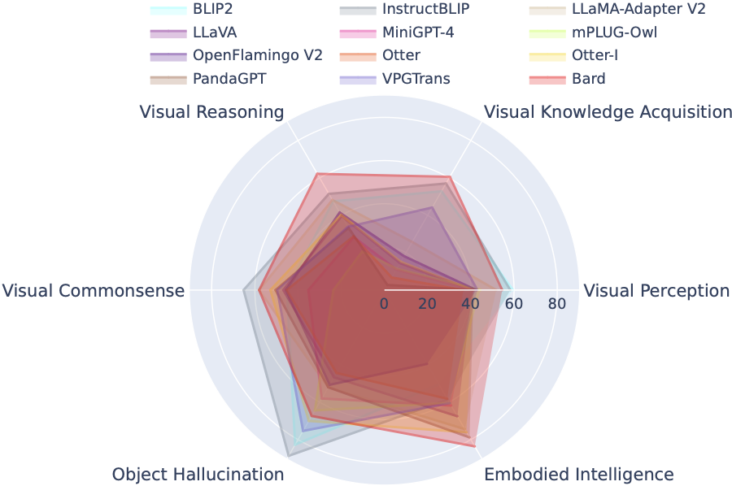

### Multi-Modality Arena 🚀

  

<p  align="center"></p>

  


<!-- ## Description -->

**Multi-Modality Arena** is an evaluation platform for large multi-modality models. Following [Fastchat](https://chat.lmsys.org/), two anonymous models side-by-side are compared on a visual question-answering task. We release the  [**Demo**](http://vlarena.opengvlab.com)  and welcome the participation of everyone in this evaluation initiative.

[](http://vlarena.opengvlab.com)
[](https://arxiv.org/abs/2306.09265)
[](https://arxiv.org/abs/2308.03729)
[](https://github.com/OpenGVLab/Multi-modality-Arena)🔥🔥🔥
                

 <p  align="center"></p>

## Holistic Evaluation of Large Multimodal Models

### OmniMedVQA: A New Large-Scale Comprehensive Evaluation Benchmark for Medical LVLM
- OmniMedVQA dataset: contains 118,010 images with 127,995 QA-items, covering 12 different modalities and referring to more than 20 human anatomical regions. Dataset could be download from [Here](https://openxlab.org.cn/datasets/GMAI/OmniMedVQA).
- 12 models: 8 general-domain LVLMs and 4 medical-specialized LVLMs.

### Tiny LVLM-eHub: Early Multimodal Experiments with Bard

- Tiny datasets: only 50 randomly selected sampels for each dataset, i.e., 42 text-related visual benchmarks and 2.1K samples in total for ease of use.
- More models: another 4 models, i.e., 12 models in total, including **Google Bard**.
- *ChatGPT Ensemble Evalution*: improved agreement with human evaluation than previous word matching approach.

<p  align="center"></p>

### LVLM-eHub: An Evaluation Benchmark for Large Vision-Language Models 🚀

LVLM-eHub is a comprehensive evaluation benchmark for publicly available large multimodal models (LVLM).  It extensively evaluates $8$ LVLMs in terms of $6$ categories of multimodal capabilities with $47$ datasets and $1$ arena online platform.
 <p  align="center"></p>

## LVLM Leaderboard
The LVLM Leaderboard systematically categorizes the datasets featured in the Tiny LVLM Evaluation according to their specific targeted abilities including visual perception, visual reasoning, visual commonsense, visual knowledge acquisition, and object hallucination.
This leaderboard includes recently released models to bolster its comprehensiveness.

You can download the benchmark from [here](https://drive.google.com/file/d/1PuFC612XzOmKwzRldtBb1CFZnIjiR7we/view?usp=sharing), and more details can be found in [here](https://github.com/OpenGVLab/Multi-Modality-Arena/tree/main/tiny_lvlm_evaluation).

| Rank | Model | Version | Score |
| :--: | :--: | :--: | :--: |
| 🏅️ | **[InternVL](https://github.com/OpenGVLab/InternVL)** | InternVL-Chat | **327.61** |
| 🥈 | **[InternLM-XComposer-VL](https://github.com/InternLM/InternLM-XComposer)** | InternLM-XComposer-VL-7B | **322.51** |
| 🥉  | **[Bard](https://bard.google.com/)** | Bard | **319.59** |
| 4 | [Qwen-VL-Chat](https://github.com/QwenLM/Qwen-VL) | Qwen-VL-Chat | 316.81 |
| 5 | [LLaVA-1.5](https://github.com/haotian-liu/LLaVA) | Vicuna-7B | 307.17 |
| 6 | [InstructBLIP](https://github.com/salesforce/LAVIS/tree/main/projects/instructblip) | Vicuna-7B | 300.64 |
| 7 | [InternLM-XComposer](https://github.com/InternLM/InternLM-XComposer) | InternLM-XComposer-7B | 288.89 |
| 8 | [BLIP2](https://github.com/salesforce/LAVIS/tree/main/projects/blip2) | FlanT5xl | 284.72 |
| 9 | [BLIVA](https://github.com/mlpc-ucsd/BLIVA) | Vicuna-7B | 284.17 |
| 10 | [Lynx](https://github.com/bytedance/lynx-llm) | Vicuna-7B | 279.24 |
| 11 | [Cheetah](https://github.com/DCDmllm/Cheetah) | Vicuna-7B | 258.91 |
| 12 | [LLaMA-Adapter-v2](https://github.com/OpenGVLab/LLaMA-Adapter/tree/main/llama_adapter_v2_multimodal7b) | LLaMA-7B | 229.16 |
| 13 | [VPGTrans](https://github.com/VPGTrans/VPGTrans) | Vicuna-7B | 218.91 |
| 14 | [Otter-Image](https://github.com/Luodian/Otter) | Otter-9B-LA-InContext | 216.43 |
| 15 | [VisualGLM-6B](https://github.com/THUDM/VisualGLM-6B) | VisualGLM-6B | 211.98 |
| 16 | [mPLUG-Owl](https://github.com/X-PLUG/mPLUG-Owl) | LLaMA-7B | 209.40 |
| 17 | [LLaVA](https://github.com/haotian-liu/LLaVA) | Vicuna-7B | 200.93 |
| 18 | [MiniGPT-4](https://github.com/Vision-CAIR/MiniGPT-4) | Vicuna-7B | 192.62 |
| 19 | [Otter](https://github.com/Luodian/Otter) | Otter-9B | 180.87 |
| 20 | [OFv2_4BI](https://github.com/mlfoundations/open_flamingo) | RedPajama-INCITE-Instruct-3B-v1 | 176.37 |
| 21 | [PandaGPT](https://github.com/yxuansu/PandaGPT) | Vicuna-7B | 174.25 |
| 22 | [LaVIN](https://github.com/luogen1996/LaVIN) | LLaMA-7B | 97.51 |
| 23 | [MIC](https://github.com/HaozheZhao/MIC) | FlanT5xl | 94.09 |


## Update
- 🔥 Oct. 16, 2023. We present an ability-level dataset split derived from the LVLM-eHub, complemented by the inclusion of eight recently released models. For access to the dataset splits, evaluation code, model inference results, and comprehensive performance tables, please visit the [tiny_lvlm_evaluation](https://github.com/OpenGVLab/Multi-Modality-Arena/tree/main/tiny_lvlm_evaluation) ✅.
- Aug. 8, 2023. We released [**[Tiny LVLM-eHub]**](https://arxiv.org/abs/2308.03729). Evaluation source codes and model inference results are open-sourced under [tiny_lvlm_evaluation](https://github.com/OpenGVLab/Multi-Modality-Arena/tree/main/tiny_lvlm_evaluation).
- Jun. 15, 2023. We release [**[LVLM-eHub]**](https://arxiv.org/abs/2306.09265), an evaluation benchmark for large vision-language models. The code is coming soon.
- Jun. 8, 2023. Thanks, Dr. Zhang, the author of VPGTrans, for his corrections. The authors of VPGTrans mainly come from NUS and Tsinghua University. We previously had some minor issues when re-implementing VPGTrans, but we found that its performance is actually better. For more model authors, please contact me for discussion at the [Email](shaowenqi@pjlab.org.cn). Also, please follow our model ranking list, where more accurate results will be available.
- May. 22, 2023. Thanks, Dr. Ye, the author of mPLUG-Owl, for his corrections. We fix some minor issues in our implementation of mPLIG-Owl.
## Supported Multi-modality Models

The following models are involving in randomized battles currently,

 - [**KAUST/MiniGPT-4**](https://github.com/Vision-CAIR/MiniGPT-4)
 - [**Salesforce/BLIP2**](https://github.com/salesforce/LAVIS/tree/main/projects/blip2)
 - [**Salesforce/InstructBLIP**](https://github.com/salesforce/LAVIS/tree/main/projects/instructblip)
 - [**DAMO Academy/mPLUG-Owl**](https://github.com/X-PLUG/mPLUG-Owl)
 - [**NTU/Otter**](https://github.com/Luodian/otter)
 - [**University of Wisconsin-Madison/LLaVA**](https://github.com/haotian-liu/LLaVA)
 - [**Shanghai AI Lab/llama_adapter_v2**](https://github.com/OpenGVLab/LLaMA-Adapter/tree/main/llama_adapter_v2_multimodal)
 - [**NUS/VPGTrans**](https://github.com/VPGTrans/VPGTrans)

More details about these models can be found at ```./model_detail/.model.jpg```. We will try to schedule computing resources to host more multi-modality models in the arena.

## Contact US at Wechat
If you are interested in any pieces of our VLarena platform, feel free to join the Wechat group.
 <p  align="left"></p>

## Installation
1. Create conda environment
```bash
conda create -n arena python=3.10
conda activate arena
```

2. Install Packages required to run the controller and server
```bash
pip install numpy gradio uvicorn fastapi
```

3. Then for each model, they may require conflicting versions of python packages, we recommend creating a specific environment for each model based on their GitHub repo.


## Launch a Demo
 
To serve using the web UI, you need three main components: web servers that interface with users, model workers that host two or more models, and a controller to coordinate the webserver and model workers.

Here are the commands to follow in your terminal:

#### Launch the controller
```bash
python controller.py
```
This controller manages the distributed workers.

#### Launch the model worker(s)
```bash
python model_worker.py --model-name SELECTED_MODEL --device TARGET_DEVICE
```
Wait until the process finishes loading the model and you see "Uvicorn running on ...". The model worker will register itself to the controller. For each model worker, you need to specify the model and the device you want to use.

#### Launch the Gradio web server
```bash
python server_demo.py
```
This is the user interface that users will interact with.

By following these steps, you will be able to serve your models using the web UI. You can open your browser and chat with a model now.
If the models do not show up, try to reboot the gradio web server.

## Contribution Guidelines
We deeply value all contributions aimed at enhancing the quality of our evaluations. This section comprises two key segments: `Contributions to LVLM Evaluation` and `Contributions to LVLM Arena`.

### Contributing to LVLM Evaluation
You can access the most recent version of our evaluation code in the LVLM_evaluation folder. This directory encompasses a comprehensive set of evaluation code, accompanied by the necessary datasets. If you're enthusiastic about partaking in the evaluation process, please don't hesitate to share your evaluation outcomes or the model inference API with us via email at xupeng@pjlab.org.cn.

### Contributions to LVLM Arena
We extend our gratitude for your interest in integrating your model into our LVLM Arena! Should you wish to incorporate your model into our Arena, kindly prepare a model tester structured as follows:

``` python
class ModelTester:
    def __init__(self, device=None) -> None:
        # TODO: initialization of model and required pre processors
    
    def move_to_device(self, device) -> None:
        # TODO: this function is used to transfer the model between CPU and GPU (optional)
    
    def generate(self, image, question) -> str:
       # TODO: model inference code 
```

Furthermore, we are open to online model inference links, such as those provided by platforms like Gradio. Your contributions are wholeheartedly appreciated.

## Acknowledgement
We express our gratitude to the esteemed team at [ChatBot Arena](https://arena.lmsys.org/) and their paper [Judging LLM-as-a-judge](https://arxiv.org/abs/2306.05685) for their influential work, which served as inspiration for our LVLM evaluation endeavors. We would also like to extend our sincere appreciation to the providers of LVLMs, whose valuable contributions have significantly contributed to the progress and advancement of large vision-language models. Finally, we thank the providers of datasets used in our LVLM-eHub.

## Term of Use
The project is an experimental research tool for non-commercial purposes only. It has limited safeguards and may generate inappropriate content. It cannot be used for anything illegal, harmful, violent, racist, or sexual. 
