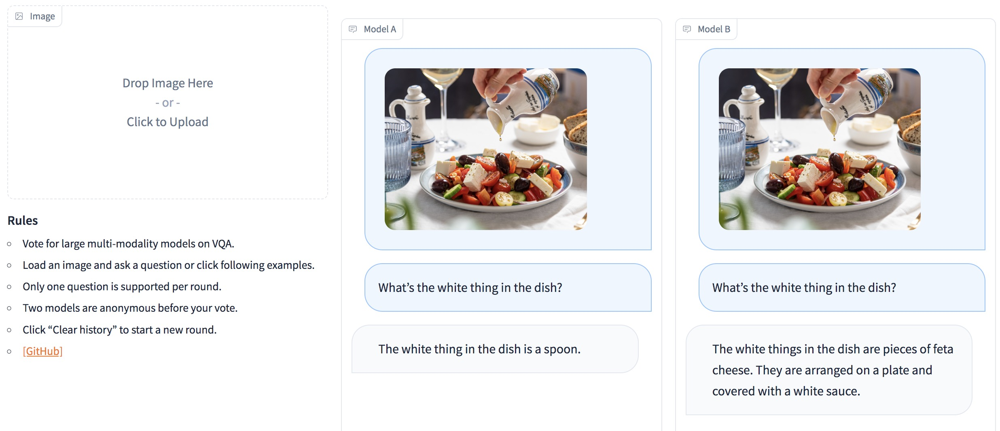

### Multi-Modality Arena

  

<p  align="center"></p>

  


<!-- ## Description -->

**Multi-Modality Arena** is an evaluation platform for large multi-modality models. Following [Fastchat](https://chat.lmsys.org/), two anonymous models side-by-side are compared on visual question answering task. We release the  [**Demo**](http://vlarena.opengvlab.com)  and welcome the participation of everyone in this evaluation initiative.

[**Demo**](http://vlarena.opengvlab.com)
 <p  align="center"></p>

## Supported Multi-modality Models

The following models are involving in randomized battles currently,

 - [**KAUST/MiniGPT-4**](https://github.com/Vision-CAIR/MiniGPT-4)
 - [**Salesforce/BLIP2**](https://github.com/salesforce/LAVIS/tree/main/projects/blip2)
 - [**DAMO Academy/mPLUG-Owl**](https://github.com/X-PLUG/mPLUG-Owl)
 - [**NTU/Otter**](https://github.com/Luodian/otter)
 - [**DeepMind/Flamingo**](https://github.com/mlfoundations/open_flamingo)

We will try to schedule computing resources to host more multi-modality models in the arena.

## Installation
1. Create conda environment
```bash
conda create -n arena python=3.10
conda activate arena
```

2. Install Packages required to run controller and server
```bash
pip install numpy gradio uvicorn fastapi
```

3. Then for each model, they may require conflict version of python packages, we recommend to create specific environment for each model based on their github repo.


## Launch a Demo
 
To serve using the web UI, you need three main components: web servers that interface with users, model workers that host two or more models, and a controller to coordinate the webserver and model workers.

Here are the commands to follow in your terminal:

#### Launch the controller
```bash
python controller.py
```
This controller manages the distributed workers.

#### Launch the model worker(s)
```bash
python model_worker.py --model-name SELECTED_MODEL --device TARGET_DEVICE
```
Wait until the process finishes loading the model and you see "Uvicorn running on ...". The model worker will register itself to the controller. For each model worker, you need to specify the model and the device you want to use.

#### Launch the Gradio web server
```bash
python server_demo.py
```
This is the user interface that users will interact with.

By following these steps, you will be able to serve your models using the web UI. You can open your browser and chat with a model now.
If the models do not show up, try to reboot the gradio web server.


## Acknowledgement
The project is built upon [Fastchat](https://chat.lmsys.org/) and open-source multi-modality models.

## Term of Use
The project is an experimental research tool for non-commercial purposes only. It has limited safeguards and may generate inappropriate content. It cannot be used for anything illegal, harmful, violent, racist or sexual. 
